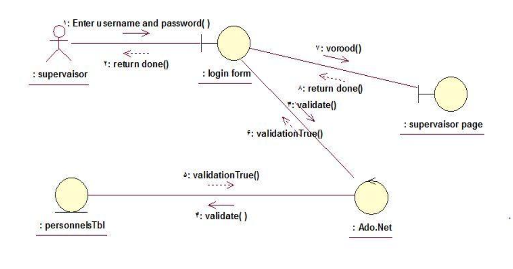

# OTA Thesis

## Login/Home Page

## Access Levels

## Login Use Case Diagram

## Application Use Case Diagram

## Admin Login Sequence Diagram

## Supervisor Login Sequence Diagram

## Employee Login Sequence Diagram

## Add a New Employee Sequence Diagram

## Add Time Record Sequence Diagram

## Admin Report Sequence Diagram

## Admin Login Collaboration Diagram

## Supervisor Login Collaboration Diagram

## User Login Collaboration Diagram

## Add a New Employee Collaboration Diagram

## Add Time Record Collaboration Diagram

## Record Approval Activity Diagram

## Application Class Diagram

## Database Schema

